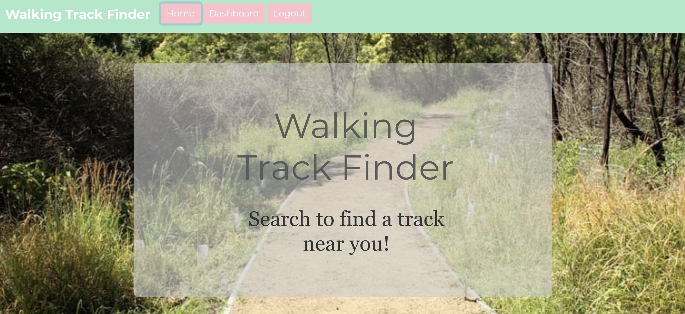
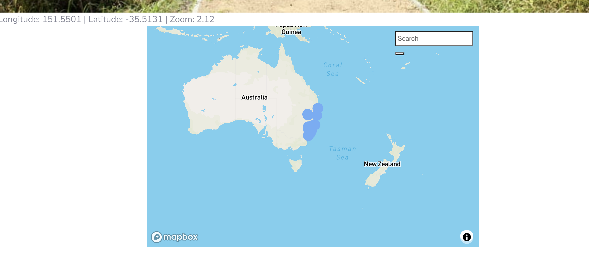
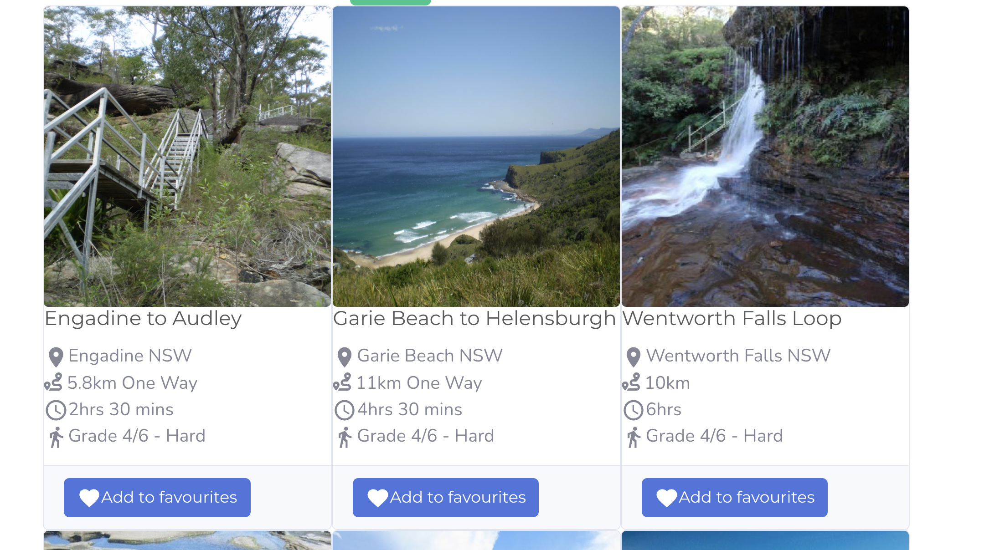
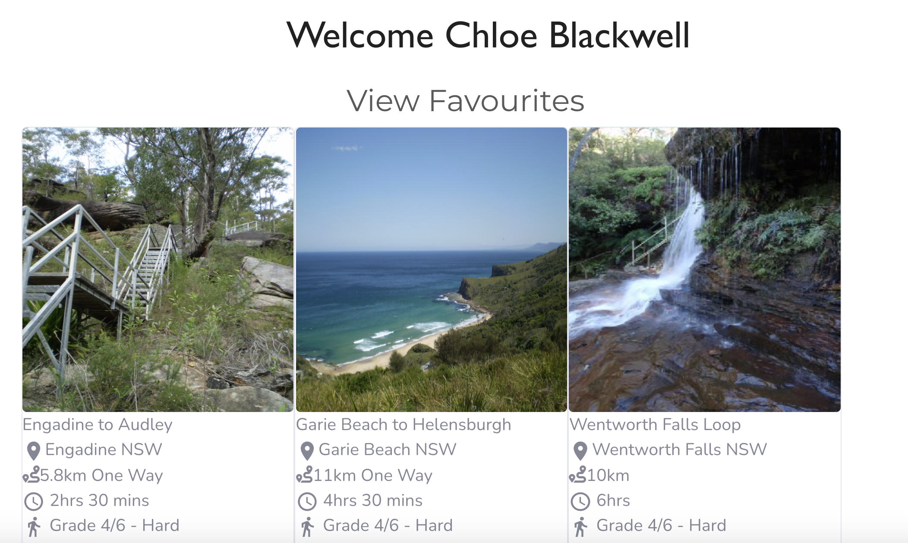

# Walking-Track-Finder

This application lets the user search for walking tracks that are nearby. The tracks information shows the distance and what the name of the track is called.

## Contents

The root directory contains the server.js file and package.json file. It also has a routes folder which contains all the back-end routes, scripts for the models, models folder which contains the tables, images which are for the README file and a validation and config folder. The client folder contains all the front-end/React components. Inside the public folder it has all the images needed for the tracks, the src folder contains all the components for the app and it also has a package.json file for the dependencies needed for the front-end.

## User Story

AS A hiker 
I WANT to find the tracks closest to my location 
SO I can discover new places

## Usage

To use this application, git clone this repository. Once you have git cloned, run npm install in both the client and root directories to install the dependencies for the application which are:

React
React DOM
Axios
Bootstrap
Bootswatch
Font Awesome Icons
Material-UI Icons
Mongoose
Passport
Cors
Dotenv
Mapbox-gl
Mapbox-geocoder-gl

The application can be invoked with npm start.

## Built With

- VS Code (https://code.visualstudio.com/)
- Terminal
- React
- Mapbox API
- Mapbox Geocoding API
- Material UI

## Screenshots

## License

This application does not have a license.

## Link to the deployed app

<a href="https://walking-track-finder.herokuapp.com/">Link to the app</a>

## Author

Chloe Blackwell 
Email: chloeblackwell.dev@gmail.com
